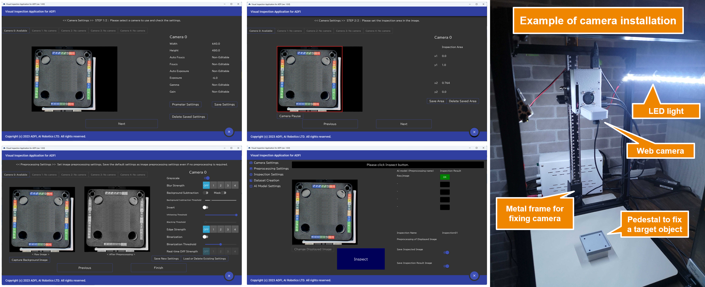

The Japanese ReadMe is described in the second half. (後半に[日本語のReadMe](#画像検査アプリケーション)を記載)

# Visual Inspection Application
This application can easily automate visual inspections and foreign matter inspections in factories.  
All you have to do is prepare an inexpensive web camera and a PC (no GPU required) and you can start inspection immediately.  
Because MIT license, you can use it for commercial purposes and modify the source code.

The following images are application screens and a camera installation example.


## Application features
 - Works on a PC without GPU.
 - Works with an inexpensive webcam (no need for expensive camera).
 - You can specify the area to inspect in the image.
 - Inspection supports both conventional AI and deep learning-based AI.
 - AI model creation with no-code is realized by using ADFI.
 - Capable of pre-processing more than 10 types of images (Grayscaling, edge extraction, mask processing, etc.).
 - Multiple AIs can simultaneously inspect (double check).
 - By using multiple cameras, the top and sides of an object can be inspected simultaneously.

# Quick & easy start
## 1) Install
Clone this repository and install the libraries(numpy, opencv-python, Pillow, kivy, kivymd) in a Python>=3.7.0 environment.
```
git clone https://github.com/karakurai/visual_inspection.git
cd visual_inspection
pip install -r requirements.txt
```

## 2) Application launch
Start the application by running main.py.
```
python main.py
```

## 3) Set display scaling
If the layout of the application is broken, [set the display scaling (display settings in your OS) to 100%.](https://support.microsoft.com/en-us/windows/1d5830c3-eee3-8eaa-836b-abcc37d99b9a)

# Application manual
The Application manual can be downloaded below.  
https://adfi.jp/

# To Manufacturing Companies
By modifying the file below, you can change the initial values of the application, such as camera FPS and resolution.  
However, if the camera cannot be change the settings, the value will not be reflected.
```
conf.ini
```

Training images for creating an AI model are saved in the following directory.
```
dataset
```

The inspected images are saved in the following directory.
```
inspection_image
```

Result images and result CSV are saved in the following directory.
```
result
```

# To Software Developers
This software is MIT licensed, so you can use it commercially.  
You may also modify the source code and provide it to your customers.

You can change the logo of the application by replacing the image file below.
```
adfi_client_app_data/logo/adfi.png
adfi_client_app_data/logo/logo.png
```

You can change the copyright by modifying the value of "label_copyright" in the file below.
```
text.ini
```

# 画像検査アプリケーション
工場での外観検査や異物検査を簡単に自動化できるアプリケーションです。表示言語は英語と日本語を選択できます。  
安価なWEBカメラとPC（GPU不要）を用意するだけで、すぐに検査を開始できます。  
MITライセンスのため、商用利用やソースコードの改変が可能です。

## アプリケーションの特徴
 - 一般的な（GPU無しの）PCで動作します。
 - 安価なウェブカメラで動作します (高価なカメラは必要ありません)。
 - 画像内の検査する領域を指定できます。
 - 従来の AI 、ディープラーニングベースの AI のどちらも対応しています。
 - ADFIを利用することでノーコードでのAIモデル作成を実現しています。
 - 10種類以上の画像の前処理（グレースケール化、エッジ抽出、マスク処理など）が利用できます。
 - 複数のAIによる同時検査（ダブルチェック）が可能です。
 - 複数のカメラを使用することで、対象物の上面と側面を同時に検査することも可能です。

# 開始手順
## 1) インストール
このリポジトリをクローンし、Python3.7以上の環境でライブラリ（numpy, opencv-python, Pillow, kivy, kivymd）をインストールしてください。
```
git clone https://github.com/karakurai/visual_inspection.git
cd visual_inspection
pip install -r requirements.txt
```

## 2) アプリケーション起動
main.pyを実行して、アプリケーションを起動してください。
```
python main.py
```

## 3) ディスプレイのスケーリング設定
アプリケーションのレイアウトが崩れていた場合、[OSのディスプレイ設定の拡大率を100%に設定してください。](https://support.microsoft.com/ja-jp/windows/1d5830c3-eee3-8eaa-836b-abcc37d99b9a)

# アプリケーションマニュアル
下記URLからアプリケーションマニュアルをダウンロードできます。  
https://adfi.jp/

# 製造業向け情報
下記ファイルを修正することで、カメラのFPSや解像度など、アプリケーションの初期値を変更できます。  
ただし、設定変更できないカメラの場合、値は反映されません。
```
conf.ini
```

AIモデル作成のための学習画像は下記ディレクトリに保存されます。
```
dataset
```

検査した画像は下記ディレクトリに保存されます。
```
inspection_image
```

結果画像と結果CSVは下記ディレクトリに保存されます。
```
result
```

# ソフトウェア開発企業向け情報
このソフトウェアはMITライセンスのため、商用利用が可能です。  
ソースコードを修正して、顧客に提供することができます。

下記画像ファイルを差し替えることで、アプリケーションのロゴを変更することができます。
```
adfi_client_app_data/logo/adfi.png
adfi_client_app_data/logo/logo.png
```

下記ファイルの「label_copyright」の値を修正することで、著作権表示を変更することができます。
```
text.ini
```
